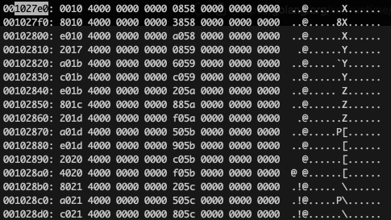

# Extracting function names from Go >= 1.16 stripped binaries

## Abstract

Some time ago I was given an artifact extracted from a compromise and it turned out to be a legit reverse proxy written in Go and compiled stripped.

Reversing such binary was sort of a pain with free tools such as Radare2 or Ghidra and while I searched for some plugins I found out there were some that would do function name recovery, because apparently this is possible in Go even with stripped binary. However these plugins were written for Go <= 1.12 and, since then, things have changed in Go internals so I decided to take a closer look at these, the binaries that the compiler produces and managed to write a few lines of code for a Radare2 plugin.

This is by no mean an exhaustive description on how Go binaries are compiled, linked and structured, let alone Go internals. It's just my most naive approach in order to understand what's going on there, just to extract some information that make the reverse engineering of Go binaries _a little_ easier.

## Digging in the structs

Go code is compiled and statically linked but when you instruct the compiler to strip the binary, function names are still included somewhere. I won't go through the reasons why it's like that since mine are more guesses than anything else and honestly I'm not that curious at the moment.

Looking at Go _symtab.go_ code there is a main struct called pcHeader that holds information on where function names are stored, as well as where one can retrieve their virtual addresses.

The pcHeader struct is defined as following

```go
// pcHeader holds data used by the pclntab lookups.
type pcHeader struct {
	magic          uint32  // 0xFFFFFFFA
	pad1, pad2     uint8   // 0,0
	minLC          uint8   // min instruction size
	ptrSize        uint8   // size of a ptr in bytes
	nfunc          int     // number of functions in the module
	nfiles         uint    // number of entries in the file tab.
	funcnameOffset uintptr // offset to the funcnametab variable from pcHeader
	cuOffset       uintptr // offset to the cutab variable from pcHeader
	filetabOffset  uintptr // offset to the filetab variable from pcHeader
	pctabOffset    uintptr // offset to the pctab varible from pcHeader
	pclnOffset     uintptr // offset to the pclntab variable from pcHeader
}
```

We are interested in funcnameOffset, pclnOffset and another struct that is not part of pcHeader.

In funcnameOffset we find null-terminated strings representing function names, while at pclnOffset we find a struct that holds the virtual address of the function and an offset to another struct from which we can determine the function's name.

At this point I am not sure anymore about the correct definition in Go internals regarding these two structs above mentioned so I won't take any guess and will just describe what I see from the hex view of the binary.

Basically, at pclnOffset there is a sequence of data that could be represented as following

```go
type pcln struct {
  virtualAddress uint
  someOtherOffset uint
}
```

while the last struct that we need to analyse could be represented as following

```go
type function_info struct {
  virtualAddress uint
  functionNameIndex uint32
}
```

To give a better understanding, let's write a hello world program in Go, compile it stripped and open it with xxd.

```go
package main

import "fmt"

func main() {
    fmt.Println("hello world")
}
```

I compile it as a PE file, because that's where everything started

```bash
env GOOS=windows GOARCH=amd64 go build -o helloworld -ldflags "-w -s" helloworld.go
```

This makes it a stripped binary, and if we open it with Radare2 we can see unpleasant function names


But let's open the binary with xxd, pipe in less and search for faff ffff 0000 to see what's there


These are function names, very nice. Now we want to jump at pclnOffset, which should be the last value in our pcHeader struct that starts with _faff ffff 0000_. Such value is a _uintptr_ which in our case can just be treated as a regular unsigned int.

So, since pclnOffset is the last unsigned integer in our struct, it's value in this case is _208a 0300 0000 0000_ which is finally _0x38a20_. We need to add it to _0x00c9dc0_ which is where pcHeader struct starts. I personally do these calculations with a Python shell, feel free to use a calculator

```python
>>> hex(0x000c9dc0 + 0x38a20)
'0x1027e0'
>>>
```

Now we can search for _1027e0_ in xxd, omitting _0x_ obviously



Here we need to take in consideration the first integer, which is represented by _0010 4000 0000 0000_ and the following integer _0858 0000 0000 0000_. The first is the virtual address of the function, the second is an index that must be added to the offset where we just landed in order to reach the last struct we need to analyse.

So, in our first case, we have our index that is _0x5808_ and we add it to _0x1027e0_

```python
>>> hex(0x1027e0 + 0x5808)
'0x107fe8'
>>>
```

Notice that this number ends with 8, meaning we will not find it in our xxd output because all addresses are blocks of 16 and end in 0. We can still look for _107fe0_ and count up to 8 at that point


I have highlited the interesting part to make things more clear, see the first integer? It's the same virtual address we saw earlier. The next is the index from where to start reading the function's name on that huge list of null-terminated strings we saw at the beginning. In this case it's 0, so it will be the first function.

Just to be sure, let's go back and do the same for the second function


we do the math

```python
>>> hex(0x1027e0 + 0x5838)
'0x108018'
>>>
```

and we check what's up with the third structure. Again, the address ends with 8, we search for _108010_ and shift 8 bytes to the right


0xb is 11, so let's go back to pcHeader and count 11 where the strings of function names start


The tenth character is 00 which means we are correct. By starting from the eleventh character we are taking the second function's name.

## Time to code

So now that we have an idea on how things work we can write a simple script that extracts function names and addresses. I'll use Python 3.x and in this post I'll write the simplest thing I possibly can as example

```python
#!/usr/local/bin/python3

from sys import exit
import struct

def get_functions_and_addresses(filename: str):
    total_data = open(filename, 'rb').read()

    # Get position in file for pcHeader start
    magic_idx = total_data.find(b'\xfa\xff\xff\xff\x00\x00')

    # Parse pcHeader, also pcHeader size here is fixed at 64 bytes
    magic, pad1, pad2, minLC, ptrSize, nfunc, nfiles, funcnameOffset,\
                cuOffset,\
                filetabOffset,\
                pctabOffset,\
                pclnOffset = struct.unpack(
                                '<LBBBBQQQQQQQ',
                                total_data[magic_idx:magic_idx+64]
                                )

    # Offset to the first sequence of structures with virtual addresses and
    # index to string representing the function's name...
    fun_offset = magic_idx + pclnOffset

    with open(filename, 'rb') as f:
        f.seek(fun_offset)

        data = f.read()

        index = 0
        fun_index = 0

        while True:
            if fun_index >= nfunc:
                break

            # unpack virtual address and index for the next struct
            addr, idx = struct.unpack('<QQ', data[index:index+16])

            # unpack virtual address and index for the function's name
            addr2, idx2 = struct.unpack('<QI', total_data[fun_offset+idx:fun_offset+idx+12])

            # retrieve function's name
            function_name = ''

            for i in range(magic_idx+64+idx2, magic_idx+64+idx2+cuOffset):
                if total_data[i] == 0:
                    break

                function_name += chr(total_data[i])

            print((function_name, hex(addr2)))

            index += 16
            fun_index += 1

def main():
    get_functions_and_addresses('helloworld')

if __name__ == '__main__':
    main()
```

If we run this script we can notice functions and corresponding addresses being printed


To check this, we could open Radare2, rename _0x48c560_ in _main_main_  and since we expect the main function to call some print function and exit, we can take all the functions that do some printing and rename them

```bash
python3 goxtract.py|grep rintln
('fmt.Fprintln', '0x487200')
('fmt.(*pp).doPrintln', '0x48c1c0')
```

In r2 we type the following commands


Finally we browse the main_main function and see how it looks


Seems perfect to me. We have Go's function prologue that checks for the stack and in case calls the runtime_morestack function (which here is still r2 generic named) and then goes through some code that eventually calls fmt_Fprintln.

At this point we should be able to add r2pipe stuff to this script and automate the process of renaming functions.

This is not going to be covered here, check my github repo for r2go116.

Bye.
